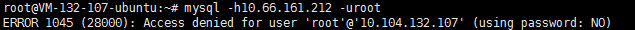
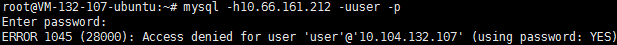

# MySQL 排障指南

### Access denied for user 'root'@'10.104.132.107' (using password: NO) 怎么办？

 上述提示是登陆时命令未输入完全，输入的命令应该是`mysql -h主机 -uroot -p` 才对
### Access denied for user 'root'@'10.104.132.107' (using password: YES)

上述提示是登陆时使用的密码是错误或权限不足，无法登陆，检查下密码和用户名、以及用户的授权主机是否正确