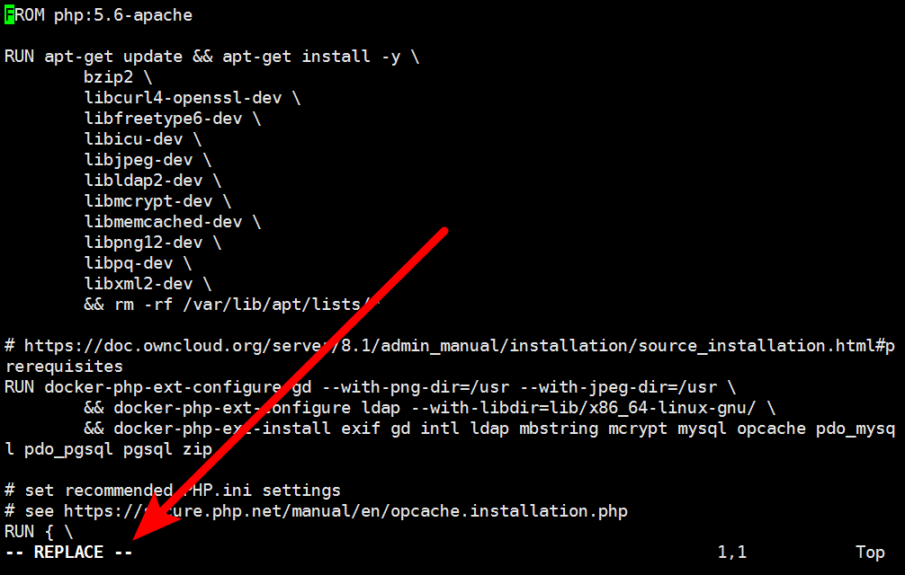
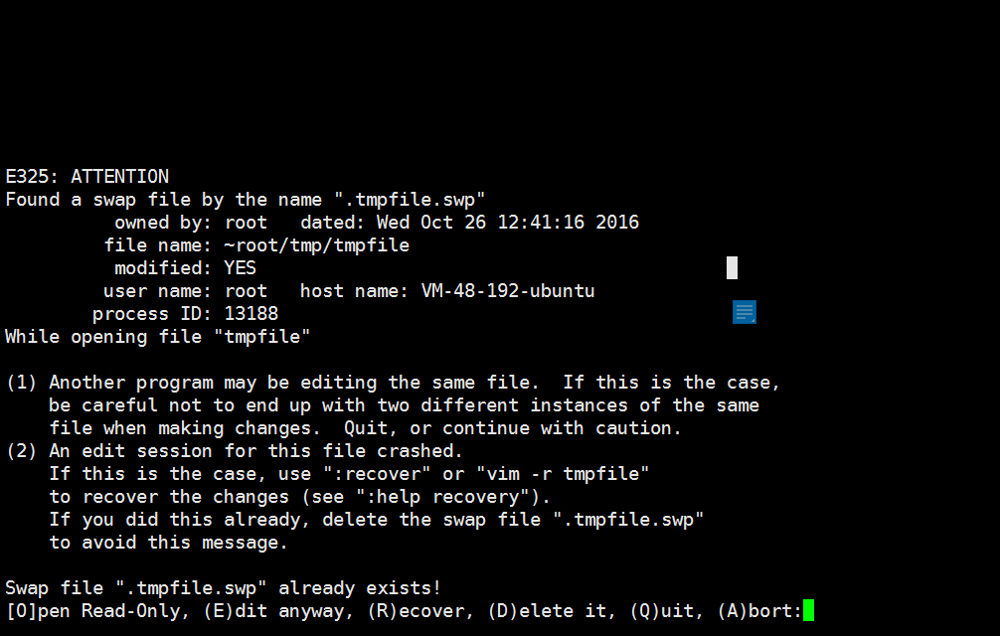

# vi 编辑工具
vi 是在Linux命令行中常用的管理工具

## 使用vi编辑文件
```
vi path/to/file
```
上述命令就是使用vi编辑文件`path/to/file`

## 如何进入编辑模式
在这样的界面下，如何进入编辑模式？


> 按下键盘上的 **i** 进入编辑模式

## 如何退出编辑模式
 在这样的界面下，如何退出编辑模式？
 
 
 > 先按下键盘上的 **ESC** 按键，再按下 **CapsLK** (大写锁定)，输入 **ZZ**， 就可以保存退出编辑模式
 
## 如何退出替换模式
 有些情况下，会误操作进入替换模式
 
 > 这时可以按下 **ESC** 按键，恢复到控制台，按下 **i ** 进入编辑模式
 
## 提示有SWP文件怎么办？
如果出现用户提示如下界面


> 先按 **Q** 退出 ，然后执行 **vi -r 文件名** 进入后按回车进入编辑模式,编辑完成后正常保存退出